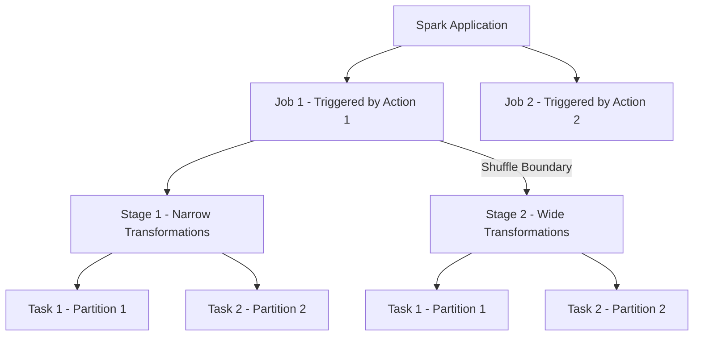

# Module 01: Apache Spark Architecture & Internals

## 1. What is Apache Spark?

Apache Spark is an open-source, distributed general-purpose cluster-computing framework. It provides in-memory computing capabilities to deliver high performance for big data processing, machine learning, and streaming analytics.

### Why Spark Over Traditional MapReduce?
- **Speed**: Spark processes data in-memory (RAM), up to 100x faster than Hadoop MapReduce which writes intermediate states to disk.
- **Unified Stack**: Supports SQL, Streaming, Machine Learning (MLlib), and Graph computations in one framework.
- **Rich APIs**: High-level declarative APIs in Python (PySpark), Scala, Java, and R.
- **Fault Tolerance**: Automatic lineage tracking recomputes only failed partitions without re-running entire pipelines.

---

## 2. Core Architectural Components

Spark uses a **Master-Worker (Driver-Executor)** architecture.

```mermaid
flowchart TD
    subgraph Client/Driver Node
        Driver[Driver Program<br/>SparkSession / SparkContext<br/>DAGScheduler & TaskScheduler]
    end

    subgraph Cluster Manager
        CM[Cluster Manager<br/>Standalone / YARN / K8s / Mesos]
    end

    subgraph Worker Node 1
        subgraph Executor 1
            T1[Task 1]
            T2[Task 2]
            M1[Executor Memory / Cache]
        end
    end

    subgraph Worker Node 2
        subgraph Executor 2
            T3[Task 3]
            T4[Task 4]
            M2[Executor Memory / Cache]
        end
    end

    Driver -->|Requests Resources| CM
    CM -->|Allocates Executors| Worker Node 1
    CM -->|Allocates Executors| Worker Node 2
    Driver -->|Sends Tasks / Code| Executor 1
    Driver -->|Sends Tasks / Code| Executor 2
    Executor 1 -->|Returns Results / Status| Driver
    Executor 2 -->|Returns Results / Status| Driver
```

### Key Components

1. **Driver Program**:
   - The central coordinator of the Spark application.
   - Contains the `SparkSession` / `SparkContext`.
   - Analyzes, translates, and schedules transformations into a physical execution graph (DAG).
   - Coordinates with the Cluster Manager for executor resources.
   - Schedules tasks across executors and aggregates final results back to the driver.

2. **Cluster Manager**:
   - Manages physical machines and resources across the cluster.
   - Supported managers: **Standalone**, **Apache YARN**, **Kubernetes (k8s)**, and **Databricks Serverless**.

3. **Executors**:
   - Worker processes running on worker nodes.
   - Responsible for executing assigned tasks in parallel threads.
   - Stores cached data partitions in memory or local disk.
   - Reports task completion, metrics, and failures back to the Driver.

---

## 3. Spark Execution Hierarchy: Application, Job, Stage, Task

Understanding how code translates into execution units is vital for debugging and optimization.



| Level | Definition | When is it Created? |
| :--- | :--- | :--- |
| **Application** | A complete Spark program running Driver & Executors | When `SparkSession` is initialized |
| **Job** | A computation triggered to produce a result | Triggered by an **Action** (e.g., `.count()`, `.collect()`, `.show()`, `.write`) |
| **Stage** | A sub-set of tasks that can run in parallel without shuffle | Delimited by **Wide Dependencies (Shuffle Boundaries)** |
| **Task** | The smallest execution unit running on a single partition on one executor core | 1 Task per Partition per Stage |

---

## 4. Directed Acyclic Graph (DAG) & Lazy Evaluation

### What is Lazy Evaluation?
In PySpark, transformations are **lazy**. When you call `.filter()`, `.select()`, or `.groupBy()`, Spark does not execute the data processing immediately. Instead, it records the operations into a **Logical Execution Plan** and builds a **Lineage Graph (DAG)**.

Execution happens ONLY when an **Action** (e.g., `count()`, `collect()`, `write`) is invoked.

### Benefits of Lazy Evaluation
1. **Whole-Stage Code Generation**: Spark combines multiple operations into single JVM bytecode instructions.
2. **Predicate Pushdown**: Filtering is pushed directly to the storage layer (e.g., Parquet / Delta), reading only matching records.
3. **Column Pruning**: Only required columns are loaded from storage into memory.
4. **Fault Recovery**: If an executor fails, Spark re-executes only the missing partitions using the lineage graph rather than starting over.

---

## 5. Summary Cheat Sheet

- **Driver = Brain** (Schedules tasks, builds DAG, holds `SparkSession`).
- **Executors = Muscles** (Run tasks, hold partitions in RAM/disk).
- **Transformations = Lazy Recipes** (Return a new DataFrame/RDD without computing).
- **Actions = Execute Order** (Triggers job execution and returns results or writes to storage).
- **1 Task = 1 Thread processing 1 Partition of a Stage**.
