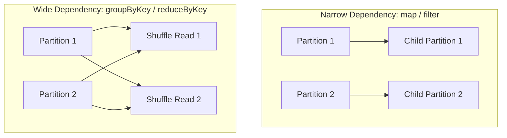

# Module 02: RDD Transformations & Actions

RDD operations fall strictly into two categories: **Transformations** and **Actions**.

---

## 1. Transformations: Narrow vs. Wide

Transformations take an existing RDD and return a new RDD. They are evaluated lazily.



### Narrow Transformations (No Shuffle)
- Each partition of the parent RDD is used by at most one partition of the child RDD.
- Fast, can be executed concurrently in-memory within the same executor.
- Examples: `map`, `filter`, `flatMap`, `mapPartitions`.

### Wide Transformations (Requires Shuffle!)
- Multiple child partitions depend on data across multiple parent partitions.
- Requires data to be written to disk, transferred across network, and sorted (a **Shuffle**).
- Examples: `groupByKey`, `reduceByKey`, `distinct`, `join`, `repartition`.

---

## 2. Common Transformations in Action

```python
from pyspark.sql import SparkSession

spark = SparkSession.builder.master("local[*]").appName("RDDTrans").getOrCreate()
sc = spark.sparkContext

data = ["apache spark", "distributed computing with spark", "spark streaming"]
rdd = sc.parallelize(data)

# 1. map(): 1-to-1 transformation
upper_rdd = rdd.map(lambda line: line.upper())
print("Mapped:", upper_rdd.collect())

# 2. flatMap(): 1-to-Many transformation (flattens list)
words_rdd = rdd.flatMap(lambda line: line.split(" "))
print("Words:", words_rdd.collect())

# 3. filter(): keeps elements that return True
spark_words = words_rdd.filter(lambda word: "spark" in word)
print("Filtered:", spark_words.collect())

# 4. distinct(): Wide transformation (removes duplicates)
unique_words = words_rdd.distinct()
print("Unique words:", unique_words.collect())
```

---

## 3. Pair RDDs & `reduceByKey` vs `groupByKey`

A Pair RDD stores key-value tuples `(key, value)`.

### ⚠️ Critical Interview Question: Why prefer `reduceByKey` over `groupByKey`?

- `groupByKey()`:
  - Transfers **ALL** key-value pairs across the network shuffle first.
  - Causes heavy network traffic and high risk of `OutOfMemoryError` (OOM).
- `reduceByKey()`:
  - Applies **Map-Side Combine** first (aggregates data locally on each partition before shuffling).
  - Significantly reduces network I/O and memory pressure!

```python
# Classic Word Count Example
pairs = words_rdd.map(lambda w: (w, 1))

# Preferred: reduceByKey (Map-side aggregation)
word_counts = pairs.reduceByKey(lambda a, b: a + b)
print("Word Counts:", word_counts.collect())
```

---

## 4. Common Actions (Trigger Execution)

Actions force evaluation of the DAG and either return a result to the Driver or write to external storage:

```python
# 1. collect(): Returns ALL elements to Driver (WARNING: Can cause Driver OOM on large datasets!)
all_data = word_counts.collect()

# 2. count(): Number of elements in RDD
total_unique = word_counts.count()

# 3. first() & take(n): Returns first or n elements (safe for driver memory)
first_word = word_counts.first()
sample_words = word_counts.take(5)

# 4. reduce(): Global reduction across all partitions
total_sum = sc.parallelize([1, 2, 3, 4, 5]).reduce(lambda a, b: a + b) # 15

# 5. countByKey(): Returns a Python dict of key counts
counts_dict = pairs.countByKey()

print(f"Total Unique: {total_unique}, Sum: {total_sum}")
```
