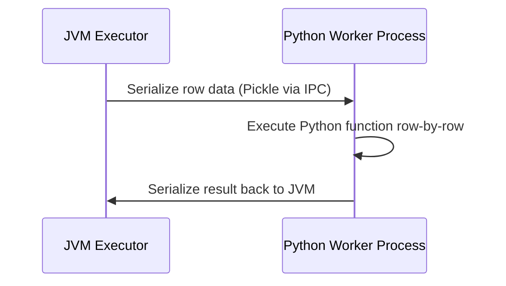

# Module 04: Standard Python UDFs vs. Vectorized Pandas UDFs

When PySpark's built-in functions cannot express your business logic, you can write **User-Defined Functions (UDFs)**. However, understanding their performance implications is critical.

---

## 1. Why Standard Python UDFs are Slow 🐢

In standard Python UDFs:
1. Data in JVM memory must be serialized into Python pickles.
2. Sent via inter-process socket (IPC) to a separate Python worker process.
3. Python worker executes your function row-by-row.
4. Output is re-serialized and sent back to JVM.
5. **No Catalyst Optimization**: The Catalyst query engine treats Python UDFs as a black box and cannot optimize across expressions!



---

## 2. Standard Python UDF Syntax

```python
from pyspark.sql import SparkSession
from pyspark.sql.functions import udf, col
from pyspark.sql.types import StringType

spark = SparkSession.builder.master("local[*]").appName("UDFDemo").getOrCreate()
df = spark.createDataFrame([(1, "john doe"), (2, "jane smith")], ["id", "name"])

# Option A: Decorator syntax
@udf(returnType=StringType())
def format_initials(full_name: str) -> str:
    if not full_name:
        return ""
    parts = full_name.split()
    return "".join(p[0].upper() for p in parts)

df.withColumn("initials", format_initials(col("name"))).show()
```

---

## 3. Vectorized Pandas UDFs (Fast! 🚀)

Introduced in Spark 2.3 and enhanced in Spark 3.0+, **Pandas UDFs** use **Apache Arrow** to transfer data between JVM and Python.

### Why Pandas UDFs are significantly faster:
- **Vectorized Batches**: Arrow uses a columnar in-memory format that eliminates serialization overhead.
- Operates on entire `pandas.Series` or `pandas.DataFrame` batches using vectorized SIMD C-extensions.
- Often **10x to 100x faster** than standard Python UDFs.

```python
import pandas as pd
from pyspark.sql.functions import pandas_udf
from pyspark.sql.types import DoubleType

data = [(1, 100.0), (2, 250.0), (3, 400.0)]
df_sales = spark.createDataFrame(data, ["id", "price"])

# Series to Series Pandas UDF
@pandas_udf(DoubleType())
def calculate_vat_pandas(prices: pd.Series) -> pd.Series:
    # Vectorized arithmetic on Pandas series
    return prices * 0.20

df_sales.withColumn("vat", calculate_vat_pandas(col("price"))).show()
```

---

## 4. Best Practice Hierarchy

Whenever you need a transformation:
1. **1st Choice (Always Prefer)**: `pyspark.sql.functions` (Runs 100% inside JVM, fully optimized by Catalyst).
2. **2nd Choice**: **Pandas Vectorized UDF** (Uses Apache Arrow, vectorized C-speed execution).
3. **Last Resort**: Standard Python UDF (Row-by-row serialization, use only when third-party Python library cannot work with Pandas/Arrow).
