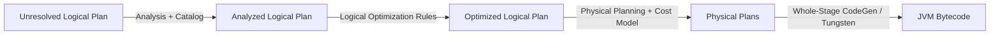

# Module 05: Catalyst Optimizer & Execution Plans

The **Catalyst Optimizer** is the core optimization engine inside Spark SQL and DataFrames. It automatically rewrites user code into the most efficient physical execution plan.

---

## 1. The Catalyst Pipeline Stages



### The 4 Phases:
1. **Analysis**: Resolves relations and column names against the Catalog/Metastore (ensures columns and tables actually exist and types are compatible).
2. **Logical Optimization**: Applies rule-based optimizations:
   - **Predicate Pushdown**: Moves filters as close as possible to the physical data source.
   - **Projection Pruning**: Drops unused columns early in the pipeline.
   - **Constant Folding**: Precomputes constants (e.g., `1 + 1` $\rightarrow$ `2`).
3. **Physical Planning**: Generates multiple physical plans and uses a Cost-Based Optimizer (CBO) to choose the best strategy (e.g., choosing BroadcastHashJoin vs SortMergeJoin).
4. **Code Generation (Tungsten)**: Generates highly optimized compact Java bytecode (Whole-Stage Code Generation) to eliminate virtual function dispatch.

---

## 2. Reading Execution Plans with `explain()`

```python
from pyspark.sql import SparkSession
from pyspark.sql.functions import col

spark = SparkSession.builder.master("local[*]").appName("Catalyst").getOrCreate()

df1 = spark.range(1, 100000).withColumn("val", col("id") * 2)
df2 = spark.range(1, 1000).withColumn("info", col("id") + 10)

# Join and filter
joined = df1.join(df2, on="id").filter(col("val") > 500)
```

### Outputting Plans:
```python
# 1. Simple Physical Plan
joined.explain()

# 2. Extended Plan (Parsed, Analyzed, Optimized, and Physical Plans)
joined.explain(extended=True)

# 3. Formatted Plan (Clean, tree-like presentation - Spark 3.0+)
joined.explain(mode="formatted")
```

---

## 3. How to Interpret Plan Operators

| Operator | Meaning | Performance Impact |
| :--- | :--- | :--- |
| `FileScan parquet ... [PushedFilters: [...]]` | Reading files with predicate pushdown | **Fast**: Only required rows are read from storage. |
| `BroadcastHashJoin` | Small table broadcast to all nodes | **Fastest Join**: Zero shuffle over network. |
| `SortMergeJoin` | Standard join for large-large tables | **Expensive**: Involves shuffle and sort phase. |
| `Exchange hashpartitioning(...)` | Network shuffle boundary | **Watch out**: Moving data over network. |
| `WholeStageCodegen` | Spark compiled entire stage into single Java function | **Fast**: Maximizes CPU cache efficiency. |
