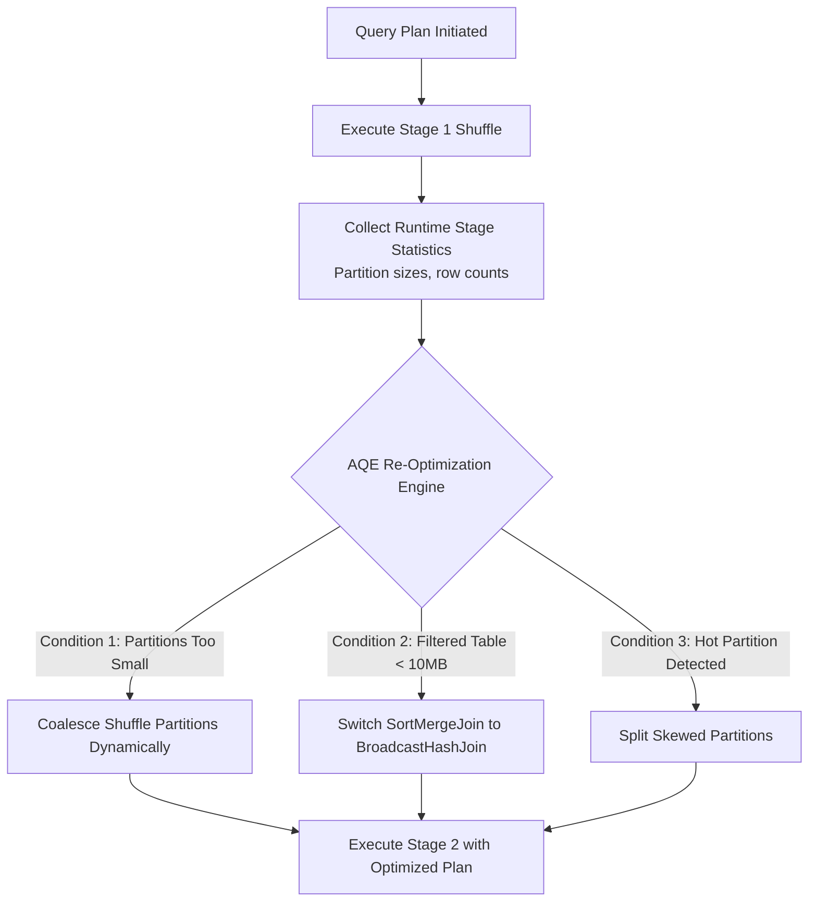

# Module 05: Adaptive Query Execution (AQE) in Spark 3.x+

Before Spark 3.0, the Catalyst Optimizer planned query execution based exclusively on static, compile-time metadata. If size estimations were inaccurate, slow plans were locked in.

**Adaptive Query Execution (AQE)** fundamentally changes this by re-optimizing query plans **at runtime** using actual partition statistics collected at the end of each shuffle stage!

---

## 1. How AQE Works



---

## 2. The Three Core Pillars of AQE

### Pillar 1: Dynamically Coalescing Shuffle Partitions
- **Problem**: Setting `spark.sql.shuffle.partitions = 200` causes thousands of tiny tasks for small tables or huge tasks for large ones.
- **AQE Solution**: Spark dynamically merges adjacent small partitions into target-sized partitions (default: 64 MB) after the shuffle stage.
- **Config**:
  ```python
  spark.conf.set("spark.sql.adaptive.coalescePartitions.enabled", "true")
  spark.conf.set("spark.sql.adaptive.advisoryPartitionSizeInBytes", "67108864") # 64MB
  ```

### Pillar 2: Dynamically Switching Join Strategies (SMJ $\rightarrow$ BHJ)
- **Problem**: Catalyst estimated a table was 100 MB at compile time, so it planned a slow Sort-Merge Join. But after filtering (`WHERE date = 'today'`), only 2 MB remains!
- **AQE Solution**: At runtime, AQE notices the filtered stage is $< 10$ MB and automatically switches the physical plan to a lightning-fast **BroadcastHashJoin**!
- **Config**:
  ```python
  spark.conf.set("spark.sql.adaptive.autoBroadcastJoinThreshold", "10485760") # 10MB
  ```

### Pillar 3: Dynamically Handling Skew Joins
- **Problem**: A single partition is 10x larger than others, causing one executor to stall.
- **AQE Solution**: AQE detects the skewed partition, splits it into multiple smaller sub-partitions, and reads the matching right-side partition multiple times, parallelizing the skewed key!
- **Config**:
  ```python
  spark.conf.set("spark.sql.adaptive.skewJoin.enabled", "true")
  spark.conf.set("spark.sql.adaptive.skewJoin.skewedPartitionFactor", "5")
  ```

---

## 3. Recommended Production Spark Session Setup

Always include these configurations in your SparkSession initialization:

```python
from pyspark.sql import SparkSession

spark = SparkSession.builder \
    .appName("AQEOptimizedApplication") \
    .config("spark.sql.adaptive.enabled", "true") \
    .config("spark.sql.adaptive.coalescePartitions.enabled", "true") \
    .config("spark.sql.adaptive.skewJoin.enabled", "true") \
    .config("spark.sql.adaptive.advisoryPartitionSizeInBytes", "134217728") \
    .getOrCreate()
```
