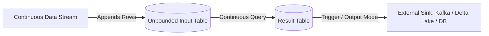

# Module 06: Structured Streaming Concepts & Architecture

Spark Structured Streaming is a scalable and fault-tolerant stream processing engine built on top of the Spark SQL engine. It allows you to express streaming computations the same way you express batch computations.

---

## 1. The Core Mental Model: Unbounded Table

In Structured Streaming, incoming data streams are treated as an **Unbounded Table** where each new record is a new row appended to an infinite table.



---

## 2. Reading Streams (`readStream`)

```python
from pyspark.sql import SparkSession
from pyspark.sql.types import StructType, StructField, StringType, IntegerType, TimestampType

spark = SparkSession.builder.master("local[*]").appName("StreamingBasics").getOrCreate()

# 1. File Source (monitors a folder for new incoming CSV/JSON/Parquet files)
file_schema = StructType([
    StructField("user_id", IntegerType()),
    StructField("action", StringType()),
    StructField("timestamp", TimestampType())
])

streaming_df = spark.readStream \
    .format("json") \
    .schema(file_schema) \
    .load("input_stream_directory/")
```

### Reading from Apache Kafka:
```python
kafka_stream = spark.readStream \
    .format("kafka") \
    .option("kafka.bootstrap.servers", "localhost:9092") \
    .option("subscribe", "user_clicks") \
    .option("startingOffsets", "latest") \
    .load()

# Kafka returns key and value as binary; cast to string:
kafka_payloads = kafka_stream.selectExpr("CAST(key AS STRING)", "CAST(value AS STRING)")
```

---

## 3. The 3 Output Modes

When writing results to an external sink, you must specify the **Output Mode**:

| Output Mode | Behavior | Compatible Queries |
| :--- | :--- | :--- |
| **`append`** (Default) | Only new rows added to Result Table since last trigger are output | Queries without aggregations or with watermarked aggregations |
| **`update`** | Only rows updated in Result Table since last trigger are output | Supported for streaming aggregations |
| **`complete`** | Entire updated Result Table is written to sink every trigger | Requires aggregations (e.g. cumulative counts) |

---

## 4. Writing Streams (`writeStream`), Triggers & Checkpointing

```python
query = streaming_df \
    .groupBy("action") \
    .count() \
    .writeStream \
    .format("console") \
    .outputMode("complete") \
    .trigger(processingTime="5 seconds") \
    .option("checkpointLocation", "/tmp/spark_checkpoints/clicks") \
    .start()

# Block until manual termination
query.awaitTermination()
```

### ⚠️ The Checkpoint Directory:
- Checkpointing is **mandatory for production streaming**.
- Stores write-ahead logs and metadata state on durable storage (S3, ADLS, HDFS).
- Guarantees **End-to-End Exactly-Once Processing** even if worker nodes or cluster fail.
