# Module 06: Windowing & Watermarking on Streams

In streaming pipelines, aggregating metrics across time requires handling real-world latency, network delays, and out-of-order events.

---

## 1. Time Semantics

- **Event Time**: The timestamp embedded within the record itself when the event occurred on the client/device (e.g. sensor reading at 14:00:01).
- **Processing Time**: The local clock time of the Spark executor machine currently processing the record (e.g. 14:02:30).
- **Ingestion Time**: The timestamp when the message arrived at the message broker (e.g. Kafka at 14:00:15).

> 💡 **Best Practice**: Always perform business aggregations on **Event Time**, not processing time!

---

## 2. Window Types

```mermaid
gantt
    title Tumbling vs Sliding Windows (10 min windows)
    dateFormat HH:mm
    axisFormat %H:%M

    section Tumbling (Non-Overlapping)
    Window 1 [12:00 - 12:10] :a1, 12:00, 10m
    Window 2 [12:10 - 12:20] :a2, 12:10, 10m
    Window 3 [12:20 - 12:30] :a3, 12:20, 10m

    section Sliding (5m Slide)
    Window A [12:00 - 12:10] :b1, 12:00, 10m
    Window B [12:05 - 12:15] :b2, 12:05, 10m
    Window C [12:10 - 12:20] :b3, 12:10, 10m
```



### A. Tumbling Windows (Fixed, Non-Overlapping)
```python
from pyspark.sql.functions import window, col

# Aggregate transactions every 10 minutes
tumbling_counts = events_df.groupBy(
    window(col("timestamp"), "10 minutes"),
    col("device_type")
).count()
```

### B. Sliding Windows (Overlapping)
```python
# 10-minute window recalculated every 5 minutes (slide duration)
sliding_counts = events_df.groupBy(
    window(col("timestamp"), "10 minutes", "5 minutes"),
    col("device_type")
).count()
```

---

## 3. Watermarking: Handling Late Data & Preventing State OOM

### The Problem:
If Spark keeps waiting for late events indefinitely, intermediate state in executor memory will grow forever until the cluster crashes with `OutOfMemoryError`.

### The Solution: `withWatermark()`
A **Watermark** establishes a trailing threshold behind the max event time seen so far:
$$\text{Watermark Threshold} = \max(\text{Event Time}) - \text{Watermark Delay}$$

- Events older than the watermark are discarded.
- Spark safely drops completed window state from memory, bounding RAM usage!

```python
# Accept data arriving up to 15 minutes late:
watermarked_stream = events_df \
    .withWatermark("timestamp", "15 minutes") \
    .groupBy(
        window(col("timestamp"), "10 minutes"),
        col("event_type")
    ) \
    .count()

# Write with Append mode (outputs finalized window results after watermark passes)
query = watermarked_stream.writeStream \
    .format("parquet") \
    .outputMode("append") \
    .option("path", "output/windowed_metrics") \
    .option("checkpointLocation", "/tmp/checkpoints/watermark") \
    .start()
```
