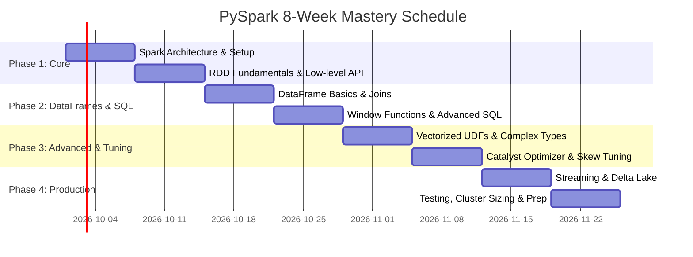

# 🚀 PySpark Master Study Roadmap

Welcome to the **Comprehensive PySpark Learning Roadmap**! This repository is designed to take you from core distributed computing fundamentals to production-grade PySpark data engineering, optimization, and real-time streaming.

---

## 🧭 Study Plan & Curriculum Overview

| Module | Topic | Description | Difficulty |
| :--- | :--- | :--- | :--- |
| **01** | [Foundations & Architecture](./01-foundations-and-architecture/) | Spark internals, Driver vs Executor, DAG, Lazy Evaluation, Setup | Beginner |
| **02** | [RDD Fundamentals](./02-rdd-fundamentals/) | Low-level distributed computing, transformations, actions, caching | Beginner |
| **03** | [DataFrame & Spark SQL](./03-dataframe-and-sparksql/) | High-level APIs, schemas, joins, aggregations, window functions | Beginner - Intermediate |
| **04** | [Advanced Transformations & UDFs](./04-advanced-transformations-and-udfs/) | Python/Pandas UDFs, nested schemas, array/map manipulation | Intermediate |
| **05** | [Performance Tuning & Optimization](./05-performance-tuning-and-optimization/) | Catalyst optimizer, AQE, shuffle tuning, skew salting, partitioning | Advanced |
| **06** | [Structured Streaming](./06-structured-streaming/) | Unbounded streams, event time, watermarking, micro-batching | Intermediate - Advanced |
| **07** | [Storage Formats & Lakehouse](./07-storage-formats-and-lakehouse/) | Parquet, ORC, Delta Lake (ACID, Time Travel, Upserts), Iceberg | Intermediate |
| **08** | [MLlib & Machine Learning](./08-mllib-and-machine-learning/) | Feature engineering pipelines, classification, regression | Intermediate |
| **09** | [Production & Deployment](./09-production-and-deployment/) | `spark-submit`, cluster sizing, CI/CD, unit testing with `chispa` | Advanced |
| **10** | [Interview Prep & Cheat Sheets](./10-interview-prep-and-cheat-sheets/) | Quick reference cheatsheet, top 50 Q&A, real scenario problems | All Levels |

---

## 📅 Recommended 8-Week Learning Schedule

### 🗓️ Breakdown by Week

- **Week 1: Foundations & Architecture**
  - Read [01_spark_architecture.md](./01-foundations-and-architecture/01_spark_architecture.md)
  - Complete local or cloud setup in [02_environment_setup.md](./01-foundations-and-architecture/02_environment_setup.md)
  - Understand `SparkSession` in [03_spark_session_and_context.md](./01-foundations-and-architecture/03_spark_session_and_context.md)

- **Week 2: RDD Fundamentals**
  - Lineage, partitions, immutability: [01_rdd_basics.md](./02-rdd-fundamentals/01_rdd_basics.md)
  - Narrow vs. wide transformations: [02_transformations_and_actions.md](./02-rdd-fundamentals/02_transformations_and_actions.md)
  - Persistence and caching: [03_persistence_and_caching.md](./02-rdd-fundamentals/03_persistence_and_caching.md)
  - Complete [04_rdd_exercises.md](./02-rdd-fundamentals/04_rdd_exercises.md)

- **Week 3: DataFrames & Essential Manipulations**
  - Schemas, file reading/writing: [01_dataframe_basics.md](./03-dataframe-and-sparksql/01_dataframe_basics.md)
  - Column operations and built-in functions: [02_column_operations_and_functions.md](./03-dataframe-and-sparksql/02_column_operations_and_functions.md)
  - Grouping, pivot, and aggregations: [03_aggregations_and_grouping.md](./03-dataframe-and-sparksql/03_aggregations_and_grouping.md)

- **Week 4: Joins, Window Functions & Spark SQL**
  - Join mechanics and broadcast joins: [04_joins_and_unions.md](./03-dataframe-and-sparksql/04_joins_and_unions.md)
  - Window functions (`lead`, `lag`, `row_number`, running totals): [05_window_functions.md](./03-dataframe-and-sparksql/05_window_functions.md)
  - Catalog and SQL queries: [06_spark_sql_queries.md](./03-dataframe-and-sparksql/06_spark_sql_queries.md)
  - Complete [07_dataframe_exercises.md](./03-dataframe-and-sparksql/07_dataframe_exercises.md)

- **Week 5: Advanced Transformations & UDFs**
  - Standard UDFs vs. Pandas Vectorized UDFs: [01_python_and_pandas_udfs.md](./04-advanced-transformations-and-udfs/01_python_and_pandas_udfs.md)
  - Structs, Arrays, Maps, and JSON parsing: [02_complex_data_types.md](./04-advanced-transformations-and-udfs/02_complex_data_types.md)
  - Data cleaning & deduplication: [03_handling_nulls_and_duplicates.md](./04-advanced-transformations-and-udfs/03_handling_nulls_and_duplicates.md)
  - Complete [04_advanced_exercises.md](./04-advanced-transformations-and-udfs/04_advanced_exercises.md)

- **Week 6: Performance Tuning & Optimization (Crucial for Interviews)**
  - Catalyst optimizer and reading execution plans: [01_query_plans_and_catalyst.md](./05-performance-tuning-and-optimization/01_query_plans_and_catalyst.md)
  - Repartition vs. coalesce, bucketing: [02_partitioning_and_bucketing.md](./05-performance-tuning-and-optimization/02_partitioning_and_bucketing.md)
  - Solving data skew with salting: [03_shuffle_and_data_skew.md](./05-performance-tuning-and-optimization/03_shuffle_and_data_skew.md)
  - Memory management & caching strategies: [04_caching_and_broadcast.md](./05-performance-tuning-and-optimization/04_caching_and_broadcast.md)
  - Adaptive Query Execution (AQE): [05_adaptive_query_execution.md](./05-performance-tuning-and-optimization/05_adaptive_query_execution.md)

- **Week 7: Streaming & Modern Lakehouse**
  - Streaming architecture & sources: [01_streaming_concepts.md](./06-structured-streaming/01_streaming_concepts.md)
  - Watermarks and sliding windows: [02_windowing_and_watermarks.md](./06-structured-streaming/02_windowing_and_watermarks.md)
  - Parquet and columnar optimization: [01_parquet_and_orc.md](./07-storage-formats-and-lakehouse/01_parquet_and_orc.md)
  - Delta Lake (ACID, Time Travel, Merge): [02_delta_lake_fundamentals.md](./07-storage-formats-and-lakehouse/02_delta_lake_fundamentals.md)

- **Week 8: Production, Testing & Interview Preparation**
  - Cluster sizing & `spark-submit`: [01_spark_submit_and_cluster_modes.md](./09-production-and-deployment/01_spark_submit_and_cluster_modes.md)
  - Unit testing PySpark code: [02_unit_testing_pyspark.md](./09-production-and-deployment/02_unit_testing_pyspark.md)
  - Master cheat sheet: [01_pyspark_cheat_sheet.md](./10-interview-prep-and-cheat-sheets/01_pyspark_cheat_sheet.md)
  - Top 50 questions & scenarios: [02_top_50_interview_questions.md](./10-interview-prep-and-cheat-sheets/02_top_50_interview_questions.md) & [03_scenario_based_questions.md](./10-interview-prep-and-cheat-sheets/03_scenario_based_questions.md)

---

## 🛠️ Quick Start Environment Options

1. **Local Python venv / uv** (Fastest for testing standalone logic)
2. **Databricks Community Edition** (Free, zero-install, pre-configured Spark environment)
3. **Google Colaboratory** (Free Jupyter notebook environment with `pip install pyspark`)
4. **Docker Container** (Includes Spark, Hadoop, JupyterLab in isolated environment)

👉 *See [02_environment_setup.md](./01-foundations-and-architecture/02_environment_setup.md) for full setup guides.*
